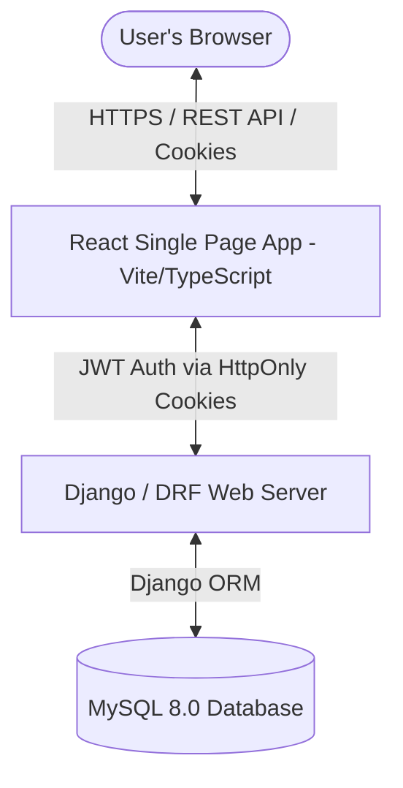

# Capstone Management Platform - Comprehensive System & Technical Documentation

Welcome to the **Capstone Management Platform** (designed for Accredian). This document is a complete, end-to-end technical guide designed for developers or administrators taking over the development, deployment, or maintenance of this platform. It covers everything from high-level architecture to database tables, codebase navigation, API references, functional logic, and environment configurations.

---

## 1. High-Level System Architecture

The platform follows a classic decoupled client-server architecture, completely containerised for seamless cross-environment deployment:



### Key Technical Specs
*   **Backend Framework:** Python 3.12 + Django 5.x + Django REST Framework (DRF) 3.15+
*   **Frontend Framework:** React 18 (Vite-powered SPA) + TypeScript + Vanilla CSS Modules
*   **Database:** MySQL 8.0 relational database
*   **Authentication & Security:** State-less JWTs stored in secure `HttpOnly` and `SameSite=Lax` cookies using `djangorestframework-simplejwt`.
*   **Containerization:** Full orchestration using Docker & Docker Compose (`docker-compose.yml`).

---

## 2. Authentication & Authorization Flow

The platform implements a secure **Dual-Token Pattern** to prevent Cross-Site Scripting (XSS) and Cross-Site Request Forgery (CSRF) vulnerabilities.

### Dual-Token Lifecycle
1.  **Authentication Request (`POST /api/auth/login/`):**
    *   The user submits their username/email and password.
    *   The backend validates credentials via [EmailOrUsernameModelBackend](file:///d:/Projects/Capstone/backend/core/authentication_backends.py).
    *   On success, the backend generates an Access Token (30-minute lifetime) and a Refresh Token (1-day lifetime).
    *   These tokens are set in `HttpOnly`, `Secure` (in production), and `SameSite` cookies by `CookieTokenObtainPairView` in [auth.py](file:///d:/Projects/Capstone/backend/core/api/views/auth.py).
2.  **Protected Requests:**
    *   The browser automatically appends the `access_token` cookie to outgoing API calls.
    *   [CustomJWTAuthentication](file:///d:/Projects/Capstone/backend/core/authentication.py) extracts the cookie, validates it, and sets `request.user`.
3.  **Silent Refresh Interceptor (`POST /api/auth/refresh/`):**
    *   If a request fails with a `401 Unauthorized` status (due to token expiration), the frontend's custom Axios interceptor intercepts the failure.
    *   It requests a new Access Token using the `refresh_token` cookie.
    *   If successful, the backend issues a new Access Token in the cookie and the frontend retries the original request seamlessly.

---

## 3. Database Schema & Models

The relational schema is configured in [models.py](file:///d:/Projects/Capstone/backend/core/models.py). The key entities are outlined below:

### 3.1. User Model (`User`)
Extends Django's `AbstractUser` to support role-based permissions:
*   `role`: Choice field (`LEARNER`, `PROFESSOR`, `ADMIN`). Default is `LEARNER`.
*   `access_until`: Date field setting learner account expiry.

### 3.2. Program Model (`Program`)
Represents an academic/professional capstone program:
*   `name` & `description`
*   `nomination_start_date` & `nomination_end_date` (controlling student signups).

### 3.3. Cohort Model (`Cohort`)
A specific run of a Program led by a Professor:
*   `program`: Foreign key to `Program`.
*   `professor`: Foreign key to `User` (Role must be `PROFESSOR`).
*   `preferred_team_size`: Target number of students per team (Default: 5).
*   `status`: Choice field (`ACTIVE`, `PENDING`, `ARCHIVED`).
*   `handbook`: File field (`upload_to="handbooks/"`) for storing cohort guidelines.

### 3.4. Cohort Membership Model (`CohortMembership`)
Tracks enrollment state of a user inside a cohort:
*   `user` & `cohort` (Unique constraint)
*   `status`: Choice field (`ACTIVE`, `GRADUATED`, `DROPPED`, `SUSPENDED`).
*   `access_until`: Date field overrides user-level access expiration.

### 3.5. Team Model (`Team`)
Groups learners in a Cohort for capstone delivery:
*   `name`: Team identifier (e.g., "Team 1").
*   `cohort`: Foreign key to `Cohort`.
*   `is_final_submitted`: Boolean flag lock for the final capstone submission.
*   `team_user`: A unique OneToOne link to a virtual `User` account created for team-shared logins.

### 3.6. Submissions & Evaluations
*   **`Task`:** Milestones/assignments posted for a cohort by a professor, with description and `deadline`.
*   **`Submission`:** File uploads (`document` PDF/Word) or `file_url` (e.g., GitHub URL) associated with a `Team` and `Task`.
*   **`Evaluation`:** Grading record containing a numeric `score` (0-100), written `feedback`, and an `evaluator` reference.

### 3.7. Notifications
*   **`Notification`:** Broad or targeted system announcements. Holds `audience` choices (`ALL`, `PROFESSORS`, `LEARNERS`, `COHORT`, `TEAM`) and `category` (`MESSAGE`, `SESSION`, `ERROR`, `SYSTEM`).
*   **`NotificationRead`:** Connects users to notifications to track read status and deletion flags.

---

## 4. Key Functional Flow Logic

The core business logic resides inside [core.py ViewSets](file:///d:/Projects/Capstone/backend/core/api/views/core.py).

### 4.1. Bulk Learner Enrollment (`upload_learners` in `CohortViewSet`)
Admins can upload a `.csv` or `.xlsx` file containing names and emails.
*   **User Provisioning:** If an email is not found in the database, the system automatically creates a `User` with `role='LEARNER'` and generates a random 8-character password.
*   **Username Generation:** Generates usernames based on the email prefix, substituting dots with underscores (e.g., `yash.agarwal12@example.com` becomes `yash_agarwal12`). If conflicts occur, a sequential counter is appended.
*   **Membership Assignment:** Links the user to the cohort via `CohortMembership`. If the user was previously enrolled in a different state (`GRADUATED` or `DROPPED`), it updates their status back to `ACTIVE`.

### 4.2. Shared Team Account Model (`_create_team_user`)
All students in a team log in using a **shared team user account** to make group submissions.
*   **Account Generation:** A virtual learner user is provisioned with the username `cohort{cohort_id}_team{team_id}`.
*   **Password Generator (`_build_human_password`):** Generates human-readable, secure passwords in the format: `SanitizedFirstWordOfTeamName-RandomFourDigitCode` (e.g. `Alpha-8314`).
*   **Membership Hook:** The virtual user is automatically assigned an `ACTIVE` `CohortMembership` to bypass access filters.

### 4.3. Auto-Generation of Teams (`auto_generate_teams`)
*   **Random Partitioning:** Fetches all `ACTIVE` learners in the cohort (excluding virtual team-account users), shuffles them, and divides them based on target `team_size`.
*   **Remainder Distribution:** Any remainder students are appended to existing groups, ensuring no small "orphaned" teams of 1 or 2 are created unless absolutely necessary.
*   **Overwriting Safeguards:** If teams already exist, the request must include `reset=True` to clear existing teams and delete corresponding virtual team-user accounts from the database.

### 4.4. Auto-Assign Late Joiners (`auto_assign_late_joiners`)
*   Scans for `ACTIVE` students in the cohort who are not members of any `Team`.
*   Iterates through them, placing each student in the cohort's smallest team.
*   If all teams are at capacity (`preferred_team_size + 1`), a new team is dynamically created.

### 4.5. Credential Dispatching (`dispatch_credentials_emails`)
*   Admins trigger a dispatch API payload containing `team_id`, `username`, and plain-text `password`.
*   The system resolves the team's student roster, renders a personalized HTML email, and dispatches the shared credentials to each student's registered email address.

---

## 5. API Reference Guide

Base URL: `http://localhost:8000/api`

| Method | Endpoint | Description | Allowed Roles |
| :--- | :--- | :--- | :--- |
| **POST** | `/auth/login/` | Logs in user, sets HttpOnly JWT cookies | Any |
| **POST** | `/auth/logout/` | Clears HttpOnly JWT cookies | Authenticated |
| **POST** | `/auth/refresh/` | Re-issues access token via refresh token cookie | Authenticated |
| **GET** | `/auth/me/` | Retrieves current logged-in user profile details | Authenticated |
| **GET** | `/cohorts/` | Lists cohorts belonging to the user's role scope | Authenticated |
| **GET** | `/cohorts/dashboard_stats/` | Retrieves global stats (students count, deadlines) | `ADMIN` |
| **POST** | `/cohorts/{id}/upload_learners/` | Bulk enrolls students from uploaded CSV/Excel | `ADMIN` |
| **POST** | `/cohorts/{id}/auto_generate_teams/` | Auto-assigns students into teams | `ADMIN` |
| **POST** | `/cohorts/{id}/auto_assign_late_joiners/` | Places unassigned students in team roster | `ADMIN` |
| **POST** | `/cohorts/{id}/upload_handbook/` | Uploads PDF/Word guide for cohort | `ADMIN` |
| **GET** | `/cohorts/{id}/download_handbook/` | Downloads cohort guide | Cohort members |
| **POST** | `/cohorts/{id}/dispatch_credentials_emails/` | Dispatches shared credentials to team members | `ADMIN` |
| **GET** | `/cohorts/{id}/unassigned_learners/` | Returns learners not assigned to any team | `ADMIN` |
| **GET** | `/cohorts/{id}/team_credentials/` | Retrieves usernames of all teams in the cohort | `ADMIN` |
| **POST** | `/cohorts/{id}/clear_learners/` | Empties cohort roster (optional accounts wipe) | `ADMIN` |

---

## 6. Frontend Routing & Codebase Structure

The React dashboard is organized into logical pages based on role-based views defined in [App.tsx](file:///d:/Projects/Capstone/frontend/src/App.tsx).

### Frontend Folder Tree
*   [frontend/src/api/](file:///d:/Projects/Capstone/frontend/src/api/) - Networking configurations, Axios instances, and global request interceptors.
*   [frontend/src/context/](file:///d:/Projects/Capstone/frontend/src/context/) - Global states including React `AuthContext` (managing tokens & users) and `ThemeContext` (handling dark/light mode toggle).
*   [frontend/src/layouts/](file:///d:/Projects/Capstone/frontend/src/layouts/) - Global structural wrappers (`AdminLayout`, `AuthLayout`).
*   [frontend/src/pages/](file:///d:/Projects/Capstone/frontend/src/pages/) - Role dashboards and dashboard pages:
    *   **Admin Dashboard:** `AdminCohortDetails.tsx`, `CohortsManagement.tsx`, `AdminUsers.tsx`, `AdminNotifications.tsx`.
    *   **Professor Dashboard:** `ProfessorCohortDetails.tsx`, `ProfessorSubmissions.tsx`, `ProfessorSubmissionReview.tsx`, `ProfessorGrading.tsx`.
    *   **Learner Dashboard:** `Submissions.tsx`, `WeeklyMode.tsx`, `Feedback.tsx`, `Tasks.tsx`.

---

## 7. Developer Local Setup & Commands

Follow these steps to configure and boot the project locally:

### 7.1. Environment Configuration
Copy the environment template and modify variables:
```bash
cp .env.template .env
```
Ensure `.env` matches your preferred local credentials.

### 7.2. Booting with Docker
The easiest way to boot the stack is via Docker Compose:
```bash
# Verify environment and start all services
./verify_docker.sh
```
Or run directly:
```bash
docker-compose up --build -d
```
This spawns:
*   MySQL on port `3306`
*   Django API on port `8000`
*   React UI on port `5173`

### 7.3. Bootstrapping Database & Admin User
To seed default values and create a superuser account:
```bash
docker exec -it capstone-backend-1 python manage.py migrate
docker exec -it capstone-backend-1 python setup_data.py
```
This generates:
*   **Superuser Login:** `admin` / `admin` (Role: `ADMIN`)
*   **Sample Program:** Software Engineering Capstone
*   **Sample Cohort:** Test Cohort

### 7.4. Seeding Test Data & Learners
To populate the database with mock learners for development:
```bash
docker exec -it capstone-backend-1 python provision_test_learners.py
```
This loads learners from [learners_test_data.csv](file:///d:/Projects/Capstone/backend/learners_test_data.csv). 
*   **Default Password:** `Welcome123!`
*   **Username Format:** `yash_agarwal12` (prefix of email with underscores instead of dots)

### 7.5. Helper / Maintenance Scripts
*   **Reset Passwords:** To reset all database accounts back to `Welcome123!`:
    ```bash
    docker exec -it capstone-backend-1 python reset_passwords.py
    ```
*   **Sanity Checks:** To run team credentials tests or Django authentication checks:
    ```bash
    docker exec -it capstone-backend-1 python smoke_test_team_creds.py
    docker exec -it capstone-backend-1 python test_auth_script.py
    ```
